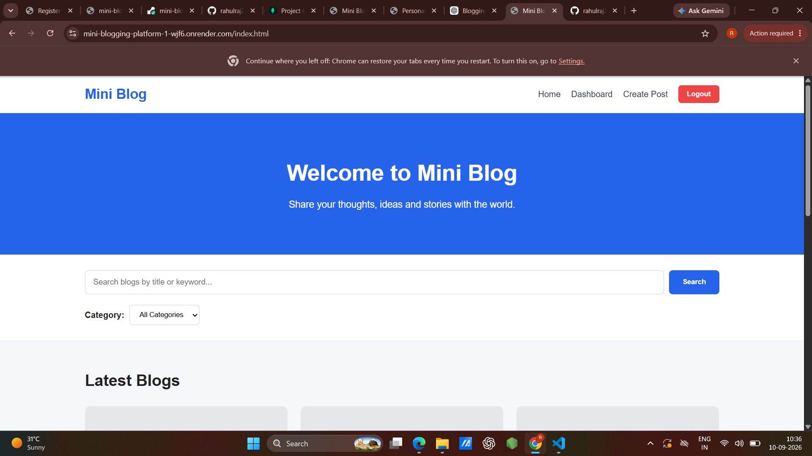
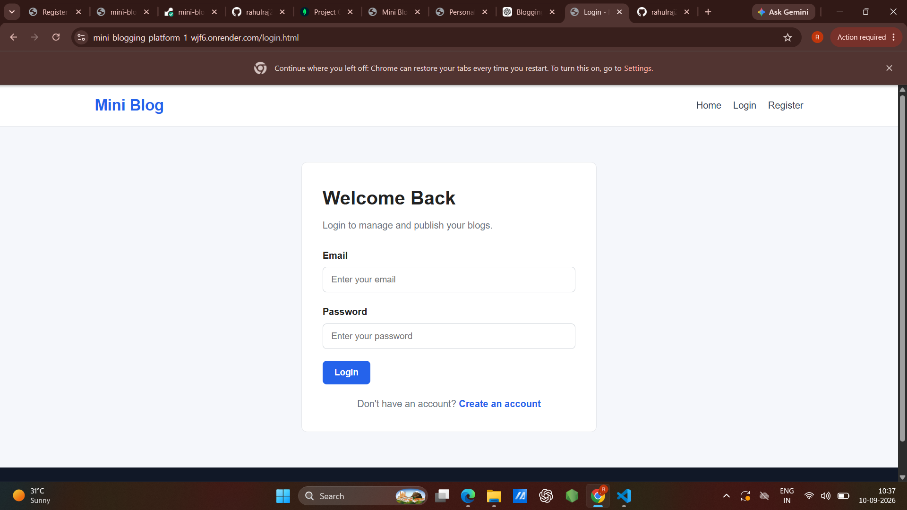
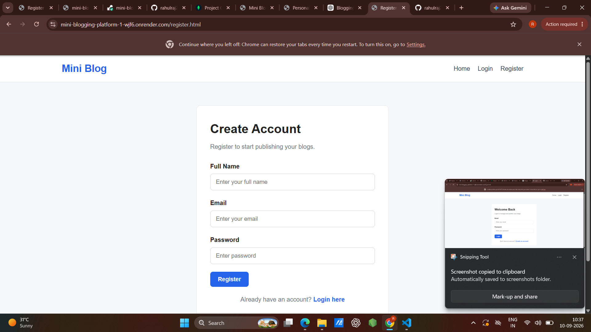
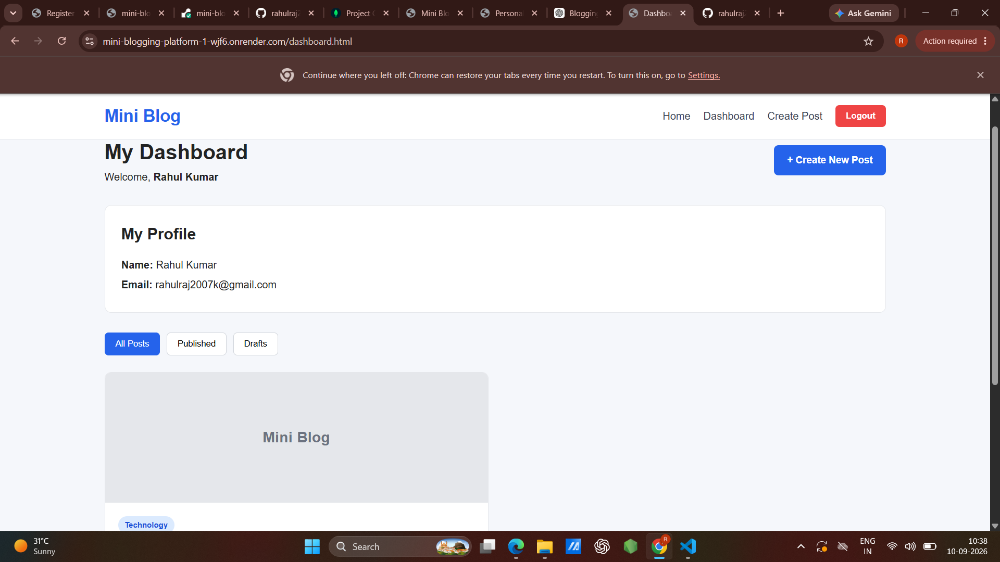
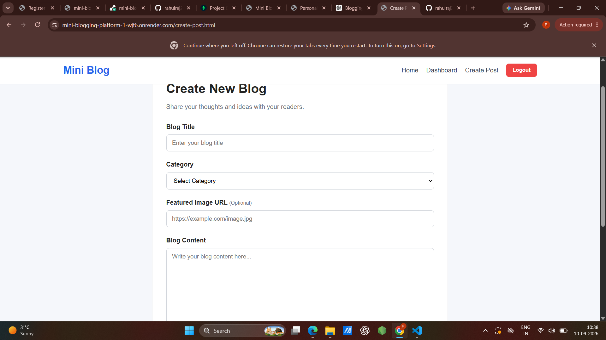
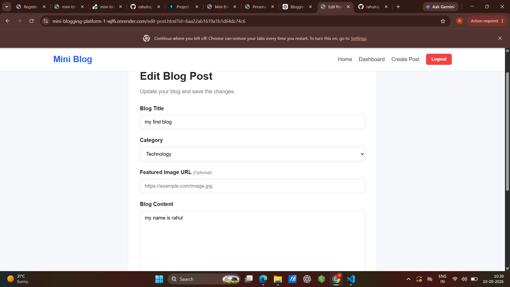
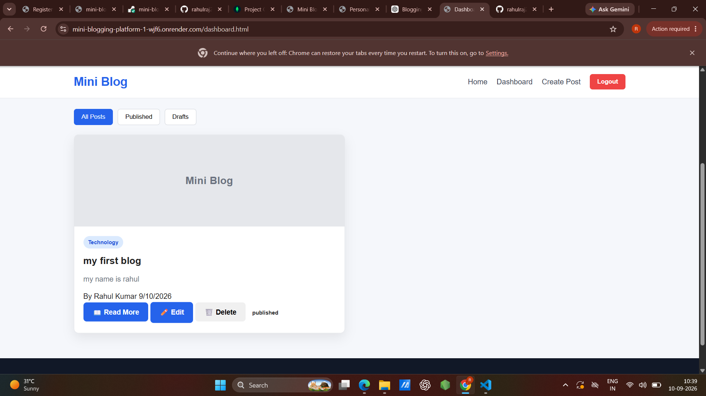
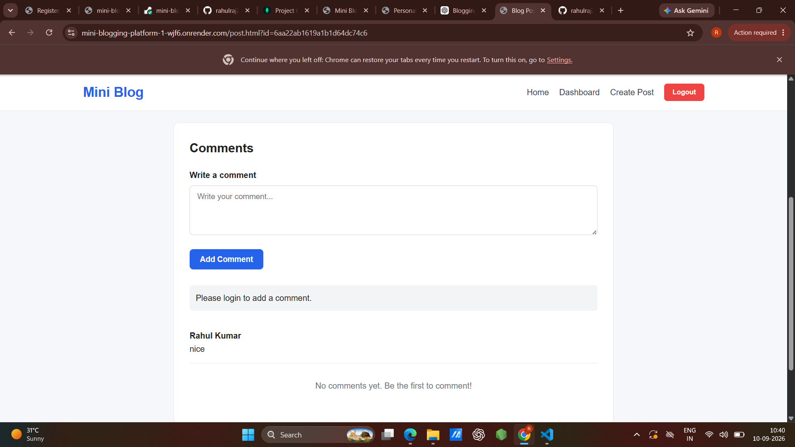

 # 📝 Mini Blogging Platform

A full-stack Mini Blogging Platform where users can register, login, create, publish, edit, and manage their own blog posts while other users can read and interact with published content.

The application provides user authentication, blog post management, search and category filtering, comments, authorization, draft functionality, and responsive design.

---

## 🚀 Live Demo

### Frontend
https://mini-blogging-platform-1-wjf6.onrender.com

### Backend API
https://mini-blogging-platform-br6r.onrender.com

### GitHub Repository
https://github.com/rahulraj2007k-pixel/mini-blogging-platform

---

## ✨ Features

### 🔐 Authentication

- User registration
- User login
- JWT-based authentication
- Password hashing using bcryptjs
- Logout functionality
- Protected routes

### 📝 Blog Posts

- Create new blog posts
- Add title and content
- Select blog category
- Add optional featured image
- Publish blog posts
- Save posts as drafts
- Edit own blog posts
- Delete own blog posts
- View complete blog posts
- Display author information

### 🔍 Search & Filter

- Search posts by title
- Search posts by keyword/content
- Filter posts by category
- Dashboard filter:
  - All Posts
  - Published Posts
  - Draft Posts

### 💬 Comments

- Add comments to published posts
- Display comments with author information
- Login required for commenting

### 🛡️ Authorization

- Users can edit only their own posts
- Users can delete only their own posts
- Protected APIs using JWT authentication
- Unauthorized users cannot manage other users' posts

### 📱 Responsive Design

- Desktop responsive layout
- Tablet responsive layout
- Mobile responsive layout

---

## 🛠️ Technologies Used

### Frontend

- HTML5
- CSS3
- JavaScript

### Backend

- Node.js
- Express.js

### Database

- MongoDB
- MongoDB Atlas
- Mongoose

### Authentication & Security

- JSON Web Token (JWT)
- bcryptjs

### Development Tools

- Visual Studio Code
- Git
- GitHub

### Deployment

- Render

---

## 📂 Project Structure

```text
Mini Blogging Platform/
│
├── backend/
│   │
│   ├── config/
│   │   └── db.js
│   │
│   ├── middleware/
│   │   └── authMiddleware.js
│   │
│   ├── models/
│   │   ├── User.js
│   │   ├── Post.js
│   │   └── Comment.js
│   │
│   ├── routes/
│   │   ├── authRoutes.js
│   │   ├── postRoutes.js
│   │   └── commentRoutes.js
│   │
│   ├── .env
│   ├── package.json
│   ├── package-lock.json
│   └── server.js
│
├── frontend/
│   │
│   ├── css/
│   │   └── style.css
│   │
│   ├── js/
│   │   ├── auth.js
│   │   ├── main.js
│   │   └── posts.js
│   │
│   ├── index.html
│   ├── login.html
│   ├── register.html
│   ├── create-post.html
│   ├── edit-post.html
│   ├── post.html
│   └── dashboard.html
│
├── screenshots/
│   ├── home.png
│   ├── login.png
│   ├── register.png
│   ├── dashboard.png
│   ├── create-post.png
│   ├── edit-post.png
│   ├── post.png
│   └── comments.png
│
├── .gitignore
└── README.md
```

---

## ⚙️ Installation & Setup

### 1. Clone the Repository

```bash
git clone https://github.com/rahulraj2007k-pixel/mini-blogging-platform.git
```

### 2. Open the Project

```bash
cd mini-blogging-platform
```

### 3. Install Backend Dependencies

```bash
cd backend
npm install
```

### 4. Configure Environment Variables

Create a `.env` file inside the `backend` folder.

```env
PORT=5000
MONGO_URI=YOUR_MONGODB_CONNECTION_STRING
JWT_SECRET=YOUR_JWT_SECRET
```

> Do not upload the `.env` file to GitHub.

### 5. Start the Backend

```bash
npm start
```

For development:

```bash
npm run dev
```

The backend will run on:

```text
http://localhost:5000
```

### 6. Run the Frontend

Open the `frontend` folder in Visual Studio Code.

The frontend can be run using VS Code Live Server.

---

## 🔑 Environment Variables

The backend requires the following environment variables:

| Variable | Description |
|---|---|
| `PORT` | Port used by the backend server |
| `MONGO_URI` | MongoDB Atlas connection string |
| `JWT_SECRET` | Secret key used for JWT authentication |

Example:

```env
PORT=5000
MONGO_URI=YOUR_MONGODB_CONNECTION_STRING
JWT_SECRET=YOUR_JWT_SECRET
```

---

## 🗄️ Database Information

The project uses **MongoDB Atlas** as the cloud database.

### Collections

The application uses the following main collections:

#### Users

Stores registered user information.

```text
User
├── name
├── email
└── password
```

#### Posts

Stores blog post information.

```text
Post
├── title
├── content
├── category
├── featuredImage
├── author
├── status
└── createdAt
```

#### Comments

Stores comments made on blog posts.

```text
Comment
├── text
├── author
├── post
└── createdAt
```

Mongoose is used for MongoDB database interaction.

---

## 🔗 API Information

### Authentication APIs

```text
POST /api/auth/register
POST /api/auth/login
GET  /api/auth/me
```

### Post APIs

```text
POST   /api/posts
GET    /api/posts
GET    /api/posts/my-posts
GET    /api/posts/search/posts
GET    /api/posts/category/:category
GET    /api/posts/:id
PUT    /api/posts/:id
DELETE /api/posts/:id
```

### Comment APIs

```text
POST /api/comments/:postId
GET  /api/comments/:postId
```

---

## 🔒 Security & Authorization

The application implements:

- JWT-based authentication
- Password hashing using bcryptjs
- Protected API endpoints
- Authentication middleware
- User authorization
- Owner-only edit permission
- Owner-only delete permission
- Environment variables for sensitive information

Users cannot edit or delete blog posts created by other users.

> Never commit database passwords, JWT secrets, or other sensitive credentials to GitHub.

---

## 🔄 Application Workflow

```text
                    User
                     │
          ┌──────────┴──────────┐
          │                     │
       Register                Login
          │                     │
          └──────────┬──────────┘
                     │
                  JWT Token
                     │
                     ▼
                 Dashboard
                     │
        ┌────────────┼────────────┐
        │            │            │
      Create       Edit         Delete
        │            │            │
        └────────────┼────────────┘
                     │
                Blog Posts
                     │
                     ▼
                  MongoDB
                     │
                     ▼
               Published Posts
                     │
          ┌──────────┴──────────┐
          │                     │
        Search                Filter
          │                     │
          └──────────┬──────────┘
                     │
                     ▼
                Single Post
                     │
                     ▼
                  Comments
```

---

## 🖥️ Application Pages

| Page | Purpose |
|---|---|
| Home Page | View published blog posts |
| Register Page | Create a new account |
| Login Page | Login to the platform |
| Dashboard | Manage personal blog posts |
| Create Post | Create and publish/save a blog |
| Edit Post | Update an existing blog |
| Single Blog | Read complete blog post |
| Comments | View and add comments |

---

## 📸 Screenshots

### 🏠 Home Page



---

### 🔐 Login Page



---

### 📝 Register Page



---

### 📊 Dashboard



---

### ✍️ Create Post



---

### ✏️ Edit Post



---

### 📖 Single Blog Post



---

### 💬 Comments



---

## 🧪 Testing

The following functionalities were tested successfully:

| Test Case | Result |
|---|---|
| User Registration | ✅ Passed |
| User Login | ✅ Passed |
| Create Published Post | ✅ Passed |
| Create Draft Post | ✅ Passed |
| View Published Posts | ✅ Passed |
| Search Posts | ✅ Passed |
| Category Filtering | ✅ Passed |
| Dashboard | ✅ Passed |
| Published Filter | ✅ Passed |
| Draft Filter | ✅ Passed |
| Edit Own Post | ✅ Passed |
| Delete Own Post | ✅ Passed |
| Add Comment | ✅ Passed |
| User Authorization | ✅ Passed |
| Responsive Layout | ✅ Passed |

---

## 🌐 Deployment

The application is deployed using **Render**.

### Frontend

```text
https://mini-blogging-platform-1-wjf6.onrender.com
```

### Backend

```text
https://mini-blogging-platform-br6r.onrender.com
```

### Database

```text
MongoDB Atlas
```

---

## 🎯 Project Objectives

The main objectives of this project are:

1. To develop a full-stack blogging web application.
2. To implement secure user authentication.
3. To allow users to create and manage their own blog posts.
4. To implement published and draft post functionality.
5. To provide search and category filtering.
6. To implement a comment system.
7. To implement proper user authorization.
8. To integrate MongoDB as the database.
9. To deploy the application online.
10. To create a responsive and user-friendly interface.

---

## 💡 Advantages

- Simple and user-friendly interface
- Secure authentication
- User-specific post management
- Search and filtering functionality
- Comment interaction
- Draft and published post support
- Responsive design
- Cloud database integration
- Online deployment

---

## ⚠️ Limitations

- No rich text editor
- No image upload service
- No email verification
- No password reset system
- No admin panel
- Basic comment functionality
- No post pagination

---

## 🔮 Future Scope

The project can be enhanced with:

- User profile pictures
- Like and unlike posts
- Bookmark/save posts
- Admin dashboard
- Rich text editor
- Cloud image upload
- Pagination
- Email verification
- Password reset
- Social media sharing
- Post tags
- User following system
- Notification system

---

## 📚 External Resources & Libraries

The project uses the following external technologies and documentation:

### Documentation

- MDN Web Docs  
  https://developer.mozilla.org/

- JavaScript Guide  
  https://developer.mozilla.org/en-US/docs/Web/JavaScript/Guide

- Node.js Documentation  
  https://nodejs.org/docs/

- Express.js Documentation  
  https://expressjs.com/

- MongoDB Documentation  
  https://www.mongodb.com/docs/

### Libraries

- Express.js
- Mongoose
- dotenv
- cors
- bcryptjs
- jsonwebtoken
- Nodemon

### Development Tools

- Visual Studio Code
- Git
- GitHub
- Render
- MongoDB Atlas

---

## 🎓 Internship Project Information

**Project Title:** Mini Blogging Platform

**Project Type:** Full-Stack Web Application

**Purpose:** Internship Project

**Frontend:** HTML5, CSS3, JavaScript

**Backend:** Node.js, Express.js

**Database:** MongoDB Atlas

**Authentication:** JWT + bcryptjs

**Deployment:** Render

---

## 👨‍💻 Developer

**Rahul Kumar**

BCA 3rd Year

---

## 📄 License

This project is developed for educational and internship purposes.